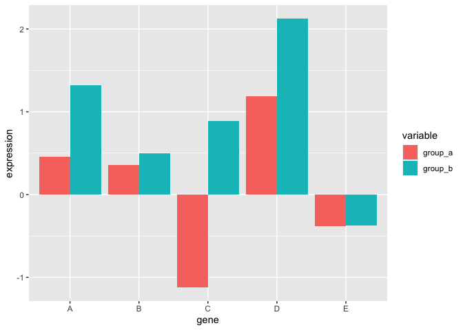
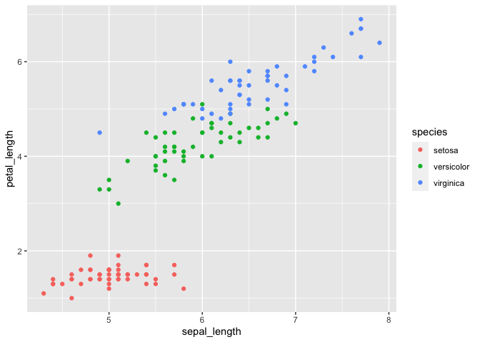
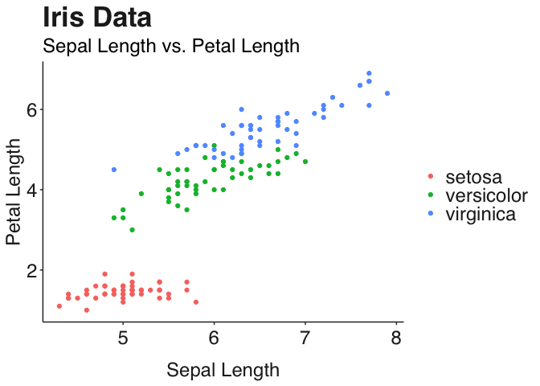
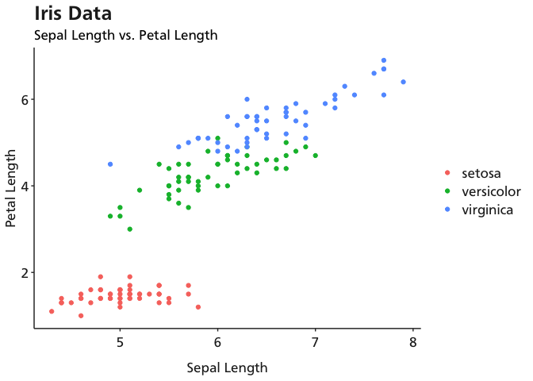
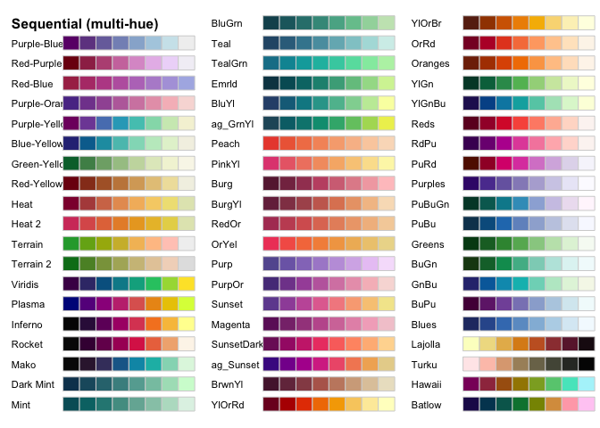
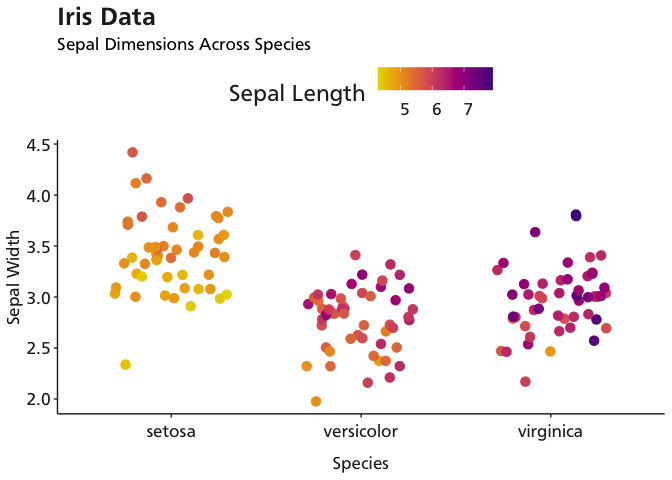
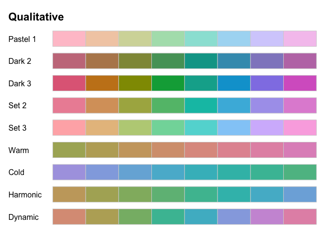

<!-- README.md is generated from README.Rmd. Please edit that file -->

``` r
library(ggplot2)
library(scales)
library(ggpubr)
library(janitor)
library(dplyr)
```

# Data melting

When using `ggplot` your data needs to be in canonical or melted format.
The format has only one independently observed value(s) in each row. All
of the other columns are metadata that explain what was measured.

``` r
# Bad
df <- data.frame(gene=LETTERS[1:5], group_a=rnorm(5), group_b=rnorm(5))
df
```

``` 
  gene    group_a    group_b
1    A  0.4595120  1.3224481
2    B  0.3538147  0.5006603
3    C -1.1244394  0.8899805
4    D  1.1868586  2.1267076
5    E -0.3816143 -0.3735585
```

``` r
# Good
df.melt <- reshape2::melt(df, value.name="expression")
df.melt
```

``` 
   gene variable expression
1     A  group_a  0.4595120
2     B  group_a  0.3538147
3     C  group_a -1.1244394
4     D  group_a  1.1868586
5     E  group_a -0.3816143
6     A  group_b  1.3224481
7     B  group_b  0.5006603
8     C  group_b  0.8899805
9     D  group_b  2.1267076
10    E  group_b -0.3735585
```

``` r
df.melt %>%
  ggplot(aes(x=gene, y=expression, group=variable, fill=variable)) +
  geom_bar(stat="identity", position=position_dodge())
```

<!-- -->

A useful trick for when your data is in a nested list. If you need to
compute things in a for loop, it’s better to use an apply function first
then convert to a dataframe all at once (rather than trying to insert a
new row into an existing dataframe).

``` r
# Bad
data <- mapply(function(g) {
  data.frame(gene=g, group_a=rnorm(1), group_b=rnorm(1))
}, LETTERS[1:5], SIMPLIFY=FALSE, USE.NAMES=FALSE)
data
```

    [[1]]
      gene   group_a    group_b
    1    A 0.3575976 -0.3879564
    
    [[2]]
      gene   group_a   group_b
    1    B -1.355808 0.6468155
    
    [[3]]
      gene   group_a  group_b
    1    C -1.823562 2.603993
    
    [[4]]
      gene group_a   group_b
    1    D 1.73746 -1.196148
    
    [[5]]
      gene   group_a     group_b
    1    E 0.9651849 -0.08012841

``` r
# Fine
df <- do.call(rbind, data)
df
```

``` 
  gene    group_a     group_b
1    A  0.3575976 -0.38795638
2    B -1.3558084  0.64681548
3    C -1.8235624  2.60399264
4    D  1.7374603 -1.19614782
5    E  0.9651849 -0.08012841
```

``` r
# Good
df.melt <- reshape2::melt(df, value.name="expression")
df.melt
```

``` 
   gene variable  expression
1     A  group_a  0.35759755
2     B  group_a -1.35580840
3     C  group_a -1.82356238
4     D  group_a  1.73746031
5     E  group_a  0.96518486
6     A  group_b -0.38795638
7     B  group_b  0.64681548
8     C  group_b  2.60399264
9     D  group_b -1.19614782
10    E  group_b -0.08012841
```

# Style and Rendering

## Fonts

*Some of these might require a license or are difficult to get for free*

    - Akzidenz Grotesque
    - Avenir
    - Avant Garde
    - Bell Gothic
    - Bodoni
    - Bembo
    - Caslon
    - Clarendon
    - Courier
    - Din Mittelschrift
    - Frankin Gothic
    - Frutiger
    - Futura
    - Garamond
    - Gill Sans
    - Gotham
    - Helvetica
    - Letter Gothic
    - Memphis
    - Meta
    - OCRB
    - Rockwell
    - Sabon
    - Trade Gothic
    - Trajan
    - Univers

R does not necessarily have access to your fonts library

``` r
library(extrafont)
font_import() # Searches for system-level fonts
fonts() # Here's what it found
loadfonts() # Register the fonts with R
```

## Style

``` r
data(iris)
df <- janitor::clean_names(iris)
head(df)
```

``` 
  sepal_length sepal_width petal_length petal_width species
1          5.1         3.5          1.4         0.2  setosa
2          4.9         3.0          1.4         0.2  setosa
3          4.7         3.2          1.3         0.2  setosa
4          4.6         3.1          1.5         0.2  setosa
5          5.0         3.6          1.4         0.2  setosa
6          5.4         3.9          1.7         0.4  setosa
```

``` r
df %>%
  ggplot(aes(x=sepal_length, y=petal_length, color=species)) +
  geom_point()
```

<!-- -->

The key ggplot parameters you will constantly modify. There are [many
more](https://ggplot2.tidyverse.org/reference/theme.html) if you’re
interested.

``` r
ggstyle <- function(font="Helvetica", scale=1) {
  fs <- function(x) x*scale # Dynamic font scaling
  ggplot2::theme(
    plot.title = ggplot2::element_text(family=font, size=fs(26), face="bold", color="#222222"),
    plot.subtitle = ggplot2::element_text(family=font, size=fs(18), margin=ggplot2::margin(0,0,5,0)),
    plot.caption = ggplot2::element_blank(),
    legend.position = "right",
    legend.text.align = 0,
    legend.background = ggplot2::element_blank(),
    legend.title = ggplot2::element_blank(),
    legend.key = ggplot2::element_blank(),
    legend.text = ggplot2::element_text(family=font, size=fs(18), color="#222222"),
    axis.title =  ggplot2::element_text(family=font, size=fs(18), color="#222222"),
    axis.text = ggplot2::element_text(family=font, size=fs(18), color="#222222"),
    axis.text.x = ggplot2::element_text(margin=ggplot2::margin(5, b=10)),
    #axis.ticks = ggplot2::element_blank(),
    axis.line = ggplot2::element_line(color="#222222"),
    panel.grid.minor = ggplot2::element_blank(),
    panel.grid.major.y = ggplot2::element_blank(),
    panel.grid.major.x = ggplot2::element_blank(),
    panel.background = ggplot2::element_blank(),
    strip.background = ggplot2::element_rect(fill="white"),
    strip.text = ggplot2::element_text(size=fs(22), hjust=0)
  )
}
```

``` r
df %>%
  ggplot(aes(x=sepal_length, y=petal_length, color=species)) +
  labs(title="Iris Data", subtitle="Sepal Length vs. Petal Length", x="Sepal Length", y="Petal Length") +
  geom_point() +
  ggstyle()
```

<!-- -->

``` r
# You can use a scaling factor to increase/decreasing font size while maintaining ratios
# this is useful when you need to boost legibility of a small figure for grant proposals with limited space
df %>%
  ggplot(aes(x=sepal_length, y=petal_length, color=species)) +
  labs(title="Iris Data", subtitle="Sepal Length vs. Petal Length", x="Sepal Length", y="Petal Length") +
  geom_point() +
  ggstyle(font="Frutiger", scale=0.75)
```

<!-- -->

## Color

Use the HCL color space. The HCL space is particularly useful for
specifying individual colors and color palettes, as its three axes match
those of the human visual system very well.

``` r
library(colorspace)
hcl_palettes("Sequential (multi-hue)", n=8, plot=TRUE)
```

<!-- -->

``` r
df %>%
  ggplot(aes(x=species, y=sepal_width, color=sepal_length)) +
  labs(title="Iris Data", subtitle="Sepal Dimensions Across Species", x="Species", y="Sepal Width" , color="Sepal Length") +
  geom_jitter(width=0.3, size=3) +
  ggstyle(font="Frutiger", scale=0.75) +
  colorspace::scale_color_continuous_sequential(palette="Plasma", begin=0.1, end=0.9) +
  # Overwrite the ggtheme to change the legend title and position
  theme(legend.position="top", 
        legend.title=element_text(family="Frutiger", size=18, color="#222222"))
```

<!-- -->

``` r
hcl_palettes("Qualitative", n=8, plot = TRUE)
```

<!-- -->

## Publication Quality Rendering

When you’re making figures, save a high quality raw TIFF that can be
imported into Photoshop for alignment with other figures. If you want to
guarantee that a journal will accept your image quality, make the raw
images close to the size of A4 standard sheet (8.3 × 11.7 inches) with a
DPI \>= 300 and then resize them later. Some journals require 600 DPI
for certain figure types so always check with the requirements first.

``` r
ggplot2::ggsave(
    filename="Figure_01.tiff",
    plot=p,
    path="/Figures",
    scale=1,
    width=8,
    height=10,
    units="in",
    dpi=300
)
```
