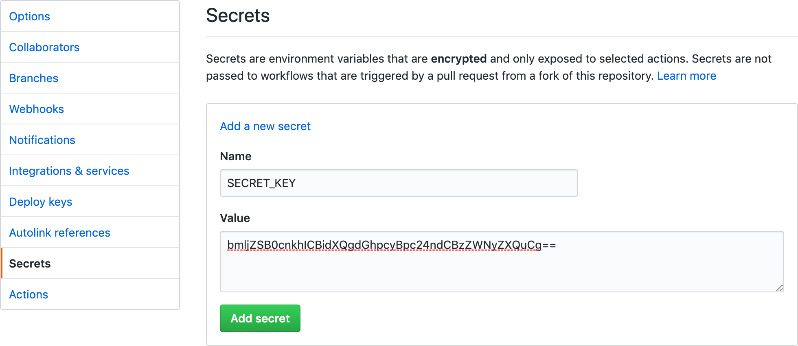
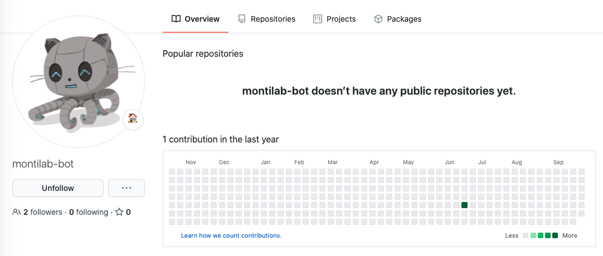

<!-- README.md is generated from README.Rmd. Please edit that file -->

```{r echo=FALSE, message=FALSE}
knitr::opts_chunk$set(message=FALSE, comment="#>")
```

# Workflow Automation

For better or worse, much of modern software development (including closed-source software) has moved to the web. In an attempt to attract users, Github and Docker (among many others) offer free compute and storage to developers and provide some incredible benefits for acadmic institutions. Taking advantage of these services while they exist will make your life as a developer more efficient and the software you create highly accessible to others. There are four major workflow automation tools that we use.

1. Github Pages
2. Docker Images
3. Docker Hub
4. Github Workflows
5. Github Issues

## Github Pages

Github Pages is a free *static* web hosting offered by Github. Each repository can have their own designated site. Static means all of the html, css, javascript, images, etc. are ready to be served. Github Pages itself does not provide you with a custom backend server (e.g. Github will not host your REST API).

The simplest example is a `index.html` file in the top-level of your main branch. However most of the time, you'll be using `pkgdown` to create documentation for your R package (or anything really).

```{r, eval=FALSE}
library(pkgdown)
pkgdown::build_site()
```

Now all of the documents needed to create your site are neatly organized in a `/docs` folder which Github Pages will recognize and serve.

## Docker Images

When you develop an R package or a Shiny application, it is becoming standard practice to include a Dockerfile. There are a few different cases when a Docker file / image is useful.

#### Distinction between Docker *file** and **image*

A Docker *file* or `Dockerfile` specifies instructions for creating a Docker *image*

A `Dockerfile` might look like this...

```bash
FROM bioconductor/bioconductor_docker:devel

WORKDIR /home/rstudio

COPY --chown=rstudio:rstudio . /home/rstudio/

RUN Rscript -e "devtools::install('.', dependencies=TRUE, repos = BiocManager::repositories())"
```

Now from this, we can build a Docker image.

```bash
docker build --tag montilab/bieulergy:latest .
```

Once it's built, we can actually go inside of it and use R with `bieulergy` pre-installed.

```bash
docker run -i -t montilab/bieulergy:latest /bin/bash
R
library(bieulergy)
```

Or even better, we can launch R Studio in the browser running out of this Docker image. If this was a Shiny application, we could also launch the Shiny app from here. 

```bash
docker run -d -p 8787:8787 -e PASSWORD=password montilab/bieulergy:latest
library(bieulergy)
bieulergy::launch_shiny()
```

P.S. Docker also works beautifully with Nextflow if your tool uses that.

```bash
nextlow run pipeliner.nf -c pipeliner.confg -with-docker montilab/pipeliner
```

Why is this important? When users or - maybe more importantly - reviewers are deciding if they like your software tool, the majority of that decision (sadly perhaps) will be based on how easy it is for them to get it installed and running. So make it **seamless**.

## Docker Hub

Can this get any better? Yes. Building a Docker image, especially one with a lot of layers and dependencies takes a long time. Since you already built the image once, wouldn't it be nice if users could just download it from you? Well that is what Docker Hub is for.

Once you've built your image, you can push it to Docker Hub.

```bash
docker push montilab/bieulergy:latest
```

Now all they have to do is pull it and run any of the commands previously.

```bash
docker pull montilab/bieulergy:latest
```

## Github Workflows

Workflows on Github are made up of a series *Github Actions*. 

> GitHub Actions help you automate tasks within your software development life cycle. GitHub Actions are event-driven, meaning that you can run a series of commands after a specified event has occurred. For example, every time someone creates a pull request for a repository, you can automatically run a command that executes a software testing script.

They live in the `.github` folder of your repository.

Here I'm telling Github to run a script in my repository `scripts/random_octocat.py` every day. Yes, Github will run your cron jobs for free!

```yml
.github
  /workflows
    /random_octocat.yml

name: random_octocat
on:
  schedule:
    - cron:  '0 0 * * *'

jobs:
  build:
    runs-on: ubuntu-latest
    steps:
    - uses: actions/checkout@v2
      with:
        token: ${{ secrets.ACCESS_TOKEN }}

    - name: 🐍 Setup Python
      uses: actions/setup-python@v2
      with:
        python-version: 3.8
        
    - name: 📥 Install Packages
      run: pip install beautifulsoup4 requests
    
    - name: random_octocat
      run: python scripts/random_octocat.py

    - uses: stefanzweifel/git-auto-commit-action@v4
      with:
        file_pattern: octocat.png
        commit_message: Update octocat
```

### Automatic Deployment of R Packages

When you make updates to an R package, you ~~should~~ *could* always do the following.

1. Run `roxygen2::roxygenize()` to update help documentation
2. Run `devtools::check()` to makes sure the package builds and all tests pass
3. Run `devtools::spell_check()` to catch any spelling mistakes
4. Run `BiocCheck::BiocCheck()` if you're really ambitious
5. Run `pkgdown::build_site()` to update the usage documentation / package landing site
6. Potentially rebuild your Docker Image
7. Push latest image to Docker hub

Another interesting helper is `goodpractice::gp()` which will mostly suggest styling changes. You only really need to run this from time to time, otherwise it becomes redundant.

During development you can do this manually with each major change, but for maintaining large packages, this gets time consuming. Additionally, and perhaps most importantly, you don't want Github Pages to read your landing site from the `/docs` folder on your main branch. When someone clones the repository, they probably don't want to download the documentation website. You should push the docs to a separate branch called `gh-pages`.  

### Bioconductor

If your R package is also in Bioconductor, you'll need to make sure you're regularly pushing updates to the Bioc branch. Bioc will run their own build tests but you can try to reproduce their tests locally with something like this. You can find the latest build settings [here](https://master.bioconductor.org/checkResults/3.13/bioc-LATEST/Renviron.bioc).

```r
devtools::check(build_args=c("--no-build-vignettes"), args=c("--force-multiarch", "--timings"))
```

Once that passes, make sure you sync with Bioc dev branch
```bash
git fetch --all
git checkout master
git merge upstream/master
git push upstream master
```

That's a lot of things, but don't worry because Github Workflows can automate all of this..

```yml
name: build
on: [push]

jobs:
  build:
    runs-on: ubuntu-latest
    container: bioconductor/bioconductor_docker:devel
    steps:
      - uses: actions/checkout@v1

      - name: Install bieulergy
        run: |
          install.packages('devtools')
          devtools::install('.', dependencies=TRUE)
        shell: Rscript {0}

      - name: Check
        env:
          _R_CHECK_CRAN_INCOMING_REMOTE_: false
        run: rcmdcheck::rcmdcheck(args=c("--no-manual"), error_on="error", check_dir="check")
        shell: Rscript {0}

      - uses: docker/build-push-action@v1
        with:
          username: ${{ secrets.DOCKER_USERNAME }}
          password: ${{ secrets.DOCKER_PASSWORD }}
          repository: montilab/bieulergy
          tag_with_ref: true
          tag_with_sha: true
          tags: latest

      - name: Build pkgdown
        run: |
           PATH=$PATH:$HOME/bin/ Rscript -e 'pkgdown::build_site("."); file.copy("media", "docs")'
      - name: Install deploy dependencies
        run: |
          apt-get update
          apt-get -y install rsync
      - name: Deploy 🚀
        uses: JamesIves/github-pages-deploy-action@releases/v3
        with:
          ACCESS_TOKEN: ${{ secrets.ACCESS_TOKEN }}
          BRANCH: gh-pages # The branch the action should deploy to.
          FOLDER: docs # The folder the action should deploy.
```

What is `${{ secrets.ACCESS_TOKEN }}`?

Github will not automatically edit your repository, someone (with write access) needs to explicitly give Github a Personal Access Token. But you need to provide it to the **Secrets** part of the repository settings. Never paste access tokens in the repository codebase. Github Secrets are essentionally environment variables that Github and third-party applications have access to.



The issue with this is by providing a personal access token on a lab repository, the repository is dependent on your account. Also that key can be used to access anything else on your personal account. Rather, we have a dedicated Github account called montilab-bot that manages all of the keys. 



To setup an access token for your repository you need to do the following.

1. Invite the montilab-bot as a contributor to your repository with write access
2. Create a new personal access token on the montilab-bot account
3. Save it as a secret in your repository

For pushing automatically to Docker Hub, we also have a dedicated Docker bot account to fill in `${{ secrets.DOCKER_USERNAME }}` and `${{ secrets.DOCKER_PASSWORD }}`.

### Github Issues

Use Github Issues to communicate with users of your software/package. When you're going back and forth with others use `reprex()` to share code snippets. 

```
library(reprex)
```

Write out your code example and then copy the entire thing.

```
x <- seq(1, 10)
mean(x)
```

Then type `reprex()` into the console. It will create a markdown snippet with the input/output of each line of code and add it directly to your clipboard. You can then paste it into a Github comment. 

``` r
x <- seq(1, 10)
mean(x)
#> [1] 5.5
```

<sup>Created on 2021-08-23 by the [reprex package](https://reprex.tidyverse.org) (v2.0.0)</sup>
